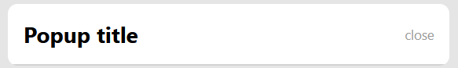
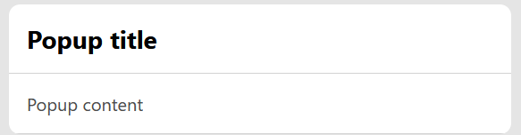
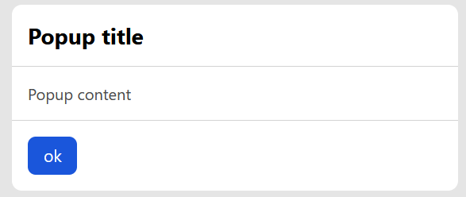
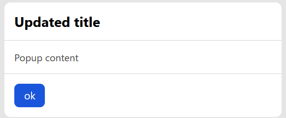
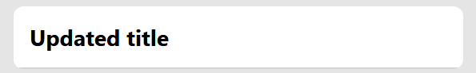
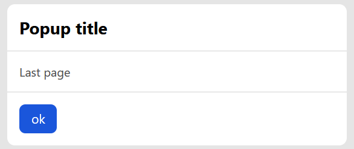

# Popup Library

If you want to create nice and powerful popups easily using javascript for your website, you're in the right place!

## Why should I use this popup library

- 🏋️ It's lightweight
- 😅 It's easy to setup
- 😉 It's easy to use
- 👍 It helps you create nice popups
- 📄 It has a great documentation

## Quick start

### Setup

Import the `PopupManager` class from the CDN link at the top of the `.js` file where you want to use the popup library as shown:

```
import PopupManager from 'https://cdn.jsdelivr.net/gh/jorgeabrahan/popup_library@67068b1/popup/Popup.js'
```

And that's it, you're done! 😁 Now check [how to use](#guide) the `PopupManager` class to create and manage your popups.

> If you are concerned about performance and you want to reduce network requests as much as possible then you can download all three files inside the `popup` folder (`popup.css`, `Popup.js`, `PopupHistory.js`) and add them to your project. Keep in mind that you will need to change the imports in the `Popup.js` file so that the other files are imported from your project and not externally.

## Guide

### Popup structure

Let's take a look at the type of popups that you can create using the popup library:


As you can see a popup may have the following elements:

- ✅ Title
- ✅ Close button
- ✅ Content
- ✅ Interaction buttons

We can organize the popup elements by sections:

- Header
  - ✅ Title
  - ✅ Close button
- Main
  - ✅ Content
- Footer
  - ✅ Interaction buttons

Keep in mind that since none of this elements are mandatory, if you don't specify them when you display the popup it'll just show an empty white box with its default dimensions, however, because of how it is styled the popup adapts depending on which elements you decide to show.

For instance, if you don't specify the `interaction buttons` when displaying the popup it won't show the `Footer` section:


Similarly, if you don't specify the `title` and `close button` elements when displaying the popup it won't show the `Header` section:


> Keep in mind that in order for the `Header` section not to be shown it has to be completely empty, if you specify either the `close button` or `title` then this section will be shown.

Lastly, if you don't specify the `content` when displaying the popup it won't show the `Main` section:



Keep in mind that because of this behavior if you don't specify any element when creating a popup it won't display anything! But there's no reason why you would do this, right?

#### Popup as object

From now on, we will treat popups as objects, because that's what they actually are in code, therefore now we'll talk about the popup elements as properties, and apart from the ones we mentioned above we need to add one more:

- ✅ Title
- ✅ Close button
- ✅ Content
- ✅ Interaction buttons
- ✅ Custom styles (added)

This custom styles property will help you change the default look of the popup if you want to, but we will talk more about the popup styles later.

Now that you know all the popup basic properties, there's a last thing worth covering. Once you create your popup you'll be able to change some properties and some others not. Let's take a look at which properties you'll be able to change or `update`:

- ✅ Title
- ✅ Content
- ✅ Interaction buttons

This means that once you define the popup `custom styles` and `close button` you won't be able to change them again.

> Keep in mind that you can always create as many popups as you need, but for each popup you create the custom styles and close button can only be defined once, of course, these properties can have a different value for each popup you create.

### Popup creation

> It's highly recommended to read the popup [structure section](#popup-structure) before learning how to create a popup!

Now that we've covered all the basic properties and structures that our popup may have, let's see how to define them through code.

> In order for all code snippets to work you should've already [setup](#setup) the popup library and imported the `PopupManager` class!

Since popups are instances of the `PopupManager` class, you can simply create a popup like this:

```
const Popup = new PopupManager({}) // notice the empty object sent as parameter!
```

When you create a popup, the `PopupManager` class it's expecting to receive an object with the 2 unchangable properties mentioned in the [popup structure](#popup-structure) section:

- ✅ Close button
- ✅ Custom styles

If you don't want to define any of these properties you still need to send an empty object as a parameter (mandatory), otherwise it'll throw an error because the `PopupManager` class constructor will try to destructure these properties.

In case you want to define these properties let's better understand what values you should send:

- ✅ Close button:
  - **name**: btnClose
  - **type**: string
  - **parent**: `<button />` tag that already has a click event handler to close the popup
  - **value**: plain text or HTML code
- ✅ Custom styles
  - **name**: style
  - **type**: string
  - **parent**: It's not its actual parent, but the sent value will be set as the `style` attribute of the popup element
  - **value**: valid CSS properties separated by `;`

Let's see an example of a popup with a close button and custom styles defined:

```
const Popup = new PopupManager({
  btnClose: 'close',
  style: 'border-width: 2px; border-style: solid; border-color: gray'
})
```

Keep in mind that, as mentioned before the `btnClose` property can also receive HTML, and that you can always use external variables to make your code more readable.

Let's rewrite the previous code using variables and [Google Icons](https://fonts.google.com/icons) to display an icon as a close button:

```
const btnClose = '<span class="material-symbols-outlined">close</span>'
const style = 'border-width: 2px; border-style: solid; border-color: gray'
const Popup = new PopupManager({ btnClose, style })
```

> If you want to test the previous code make sure to setup [Google Icons](https://fonts.google.com/icons) in your project first.

And that's it, just by following these steps you already created a `popup`! Let's now check how to display it.

### Popup display

> You should've already [created a popup](#popup-creation) by this point in order to follow up with the [popup display](#popup-display) section.

> For all code snippets presented in this section we will assume that you named the popup variable `Popup` as showed in the [previous section](#popup-creation)!

Now that you've already created your popup, let's take a look at how to display it:

```
Popup.display({}) // notice the empty object sent as parameter!
```

<a id="display-and-update-method-parameters"></a>
The `display()` method, apart from showing the popup, it expects to receive the following properties:

- ✅ Title
- ✅ Content
- ✅ Interaction buttons
- ✅ Allow closing

It is not mandatory to declare any of these properties, however, you should still send an object as a parameter, even if it is empty, to prevent errors.

In case you want to define these properties let's better understand what values you should send:

- ✅ Title:
  - **name**: title
  - **type**: string
  - **parent**: `<h3 />` tag with a default title style
  - **value**: plain text or HTML code
- ✅ Content
  - **name**: content
  - **type**: string
  - **parent**: `<main />` tag. Even though you can place plain text inside this element is recommended to use a `<p />` tag to wrap it.
  - **value**: plain text or HTML code
- ✅ Interaction buttons
  - **name**: buttons
  - **type**: object
  - **parent**: `<footer />` tag.
  - **value**: an object with the following properties:
    - `elements`:
      - **type**: array
      - **purpose**: this array of buttons will be looped to create the HTML buttons
      - **value**: button objects, each object has the following properties:
        - `text`:
          - **type**: string
          - **purpose**: this text will be placed inside the `<button />` tag
          - **value**: plain text or HTML code
        - `handler`:
          - **type**: function
          - **purpose**: this function will be called every time the button gets clicked
          - **value**: callback function
        - `type`:
          - **type**: string
          - **purpose**: basically there are three button styles predefined in the `popup.css` file, and by using the `type` property you can choose which of this templates you want to use. If you don't declare this property the button will still have a default style.
          - **value**: 'confirm | error'
        - `style`:
          - **type**: string
          - **purpose**: this styles will be applied to the button created
          - **value**: valid CSS properties separated by `;`
        - `disabled`:
          - **type**: boolean
          - **purpose**: this property will be set to the `disabled` attribute of the created button. If button is disabled pointer events won't work and handler function won't be called
          - **value**: valid CSS properties separated by `;`
    - `sharedHandler`:
      - **type**: function
      - **purpose**: this function will run everytime a button inside the popup is clicked. It receives 3 parameters: event, clicked button text, clicked button
      - **value**: callback function
    - `sharedStyles`:
      - **type**: string
      - **purpose**: this styles will be applied to all buttons created
      - **value**: valid CSS properties separated by `;`
    - `position`:
      - **type**: string
      - **purpose**: this property determines where all the buttons should be placed
      - **value**: 'left | center | right'
- ✅ Allow closing:
  - **name**: allowClosing
  - **type**: boolean
  - **purpose**: this property determines if the user will be able to close the popup, use it at your own risk. If it is set to true there will be no way of closing the popup, nor with the close button or clicking outside of it. This property is meant to be used when you need the user to wait for something to happen, like when you delete something from the database and you want the user to wait, after receiving the async response you can set this property back to true.

Here's an example on how to display this popup:


```
const Popup = new PopupManager({ btnClose: 'close' })
Popup.display({
  title: 'Popup title',
  content: 'Popup content',
  buttons: { elements: [{ text: 'Ok', handler: () => {}, type: 'confirm' }], position: 'center' }
})
```

Now it's time for you to practice, I'll show you some images and you need to try to guess how those popups are created. The code solution on how to create them will be underneath each image so try to avoid peeking before you actually solved it on your own.

#### Example 1: Popup with no title


```
const Popup = new PopupManager({})
Popup.display({
  content: 'Popup content',
  buttons: { elements: [{ text: 'Ok', handler: () => {}, type: 'confirm' }], position: 'right' }
})
```

#### Example 2: Popup with no content


```
const Popup = new PopupManager({ btnClose: 'close' })
Popup.display({
  title: 'Popup title',
  buttons: { elements: [{ text: 'Ok', handler: () => {}, type: 'confirm' }], position: 'right' }
})
```

#### Example 3: Popup with no buttons


```
const Popup = new PopupManager({ btnClose: 'close' })
Popup.display({ title: 'Popup title', content: 'Popup content' })
```

That's it, Nice work! Just one last thing, the `display()` method does three things:

- Refresh the popup `title`, `content`, and `buttons`
- Adds the updated content to the popup history
- Shows the popup

Keeping this in mind will be useful for the next section.

### Popup update

> You should've already [created a popup](#popup-creation) and learned how to [display it](#popup-display) by this point in order to follow up with the [popup update](#popup-update) section.

There are some cases in which you will want to update the popup content, you might feel tempted to create a new popup or use the `display()` method for this, but let me tell you there's no need for you to do that because there's already an `update()` method meant to solve this issue.

#### Differences between display() and update()

##### The `display()` method shows the popup and the `update()` method doesn't.

This means that you should always use the `display()` method first to show the popup and after that you can simply keep updating it with the `update()` method.

For instance, the following code **won't display anything**, even though it won't throw any errors:

```
const Popup = new PopupManager({})
Popup.update({ title: 'Popup title', content: 'Popup content' }) // notice the update method is being used
```

Whereas the same code with the display method will have the expected beheavior:



```
const Popup = new PopupManager({})
Popup.display({ title: 'Popup title', content: 'Popup content' })
```

##### The `update()` method just updates the popup _properties that were received_ as parameters

Even though both methods receive the exact <a href="#display-and-update-method-parameters">same parameters</a>, the `update()` method will only change the parameters sent to it.

<a id="update-method-additional-parameter"></a>

> Actually the update method has 1 more parameter different than the `display()` method, but we'll talk about it later in the [history section](#popup-history)

For instance, imagine you call the `display()` method and you set a `title`, `content` and `buttons`:



```
const Popup = new PopupManager({})
Popup.display({
  title: 'Popup title',
  content: 'Popup content',
  buttons: { elements: [{ text: 'ok', type: 'confirm' }] }
})
```

Let's see what happens when you call the `update()` method with just the `title`:



```
const Popup = new PopupManager({})
Popup.display({
  title: 'Popup title',
  content: 'Popup content',
  buttons: { elements: [{ text: 'ok', type: 'confirm' }] }
}).update({ title: 'Updated title' })
```

As you saw, the `content` and `buttons` remain the same, as the word says, it just "updated" the popup.

Now let's see what happens when you call the `display()` method instead of the update method:



```
const Popup = new PopupManager({})
Popup.display({
  title: 'Popup title',
  content: 'Popup content',
  buttons: { elements: [{ text: 'ok', type: 'confirm' }] }
}).display({ title: 'Updated title' })
```

As you just saw all values that are not sent return to default, which of course is not the intended behavior. We hope this gave you a better idea of when to use each method.

### Popup history

Every time you call the `display()` and `update()` methods a state of your popup is added to the popup history. The state of a popup includes only properties that can be changes or updated, properties such as:

- ✅ Title
- ✅ Content
- ✅ Interaction buttons

Having a history of your popup will allow you to navigate through it, let's take a look at two examples.

Let's see what happens if you create a popup like this:



```
const Popup = new PopupManager({})
Popup.display({
  title: 'Popup title',
  content: 'First page',
  buttons: { elements: [{ text: 'ok', type: 'confirm' }] }
})
  .update({ content: 'Second page' })
  .update({ content: 'Third page' })
  .update({ content: 'Last page' })
```

As you can see this is just displaying the last `state` or `update` of our popup, but as I mentioned before, everytime we called the `update()` and `display()` methods, a state of our popup was added to the history.

Now the question is, how can I navigate through the history, well you can use the following methods:

- `goBack()`: navigates to the previous history state if any
- `goNext()`: navigates to the next history state if any
- `goFirst()`: navigates to the first history state if any
- `goLast()`: navigates to the last history state if any

Let's add some buttons to the popup to navigate through history:

```
const Popup = new PopupManager({})
Popup.display({
  title: 'Popup title',
  content: 'First page',
  buttons: {
    elements: [
      { text: 'goBack', handler: () => Popup.goBack() },
      { text: 'goNext', handler: () => Popup.goNext() },
      { text: 'goFirst', handler: () => Popup.goFirst() },
      { text: 'goLast', handler: () => Popup.goLast() }
    ]
  }
})
  .update({ content: 'Second page' })
  .update({ content: 'Third page' })
  .update({ content: 'Last page' })
```

One last thing, as you saw from the image above, after updating our popup it prompts on the last page, in most cases this is not the intended beheavior, so to get back to the first history state we could use the methods we've already seen like this:

```
const Popup = new PopupManager({})
Popup.display({
  title: 'Popup title',
  content: 'First page',
  buttons: {
    elements: [
      { text: 'goBack', handler: () => Popup.goBack() },
      { text: 'goNext', handler: () => Popup.goNext() },
      { text: 'goFirst', handler: () => Popup.goFirst() },
      { text: 'goLast', handler: () => Popup.goLast() }
    ]
  }
})
  .update({ content: 'Second page' })
  .update({ content: 'Third page' })
  .update({ content: 'Last page' })
  .goFirst() // notice the goFirst method to get back to the first popup state after updating it
```

Let's take a look at a more real life example of a popup to ask for double confirmation to remove a file and make the user wait while it is being removed:

```
const Popup = new PopupManager({})
const onFileDelete = () => {
  Popup.update({
    content: 'File is being deleted, please wait...',
    buttons: {},
    allowClosing: false
  })
  // imagine this is an async call to delete the file
  setTimeout(() => {
    // once the file is deleted
    Popup.update({ content: 'File deleted!', allowClosing: true })
  }, 3000)
}
Popup.display({
  title: 'Delete file',
  content: 'Are you sure you want to delete this file?',
  buttons: {
    elements: [
      { text: 'Confirm', handler: () => Popup.goNext() },
      { text: 'Cancel', handler: () => Popup.close() } // notice the close method
    ]
  }
})
  .update({
    content: 'Just as a last confirmation, do you really want to remove this file?',
    buttons: {
      elements: [
        { text: 'Yes', handler: onFileDelete },
        { text: 'Back', handler: () => Popup.goBack() }
      ]
    }
  })
  .goFirst()
```

This last example is excellent to explain an <a href="#update-method-additional-parameter">additional property</a> from the `update()` method that we left out before, and that is `preserveInHistory`. Let's better understand it:

- ✅ Preserve in history:
  - **name**: preserveInHistory
  - **type**: boolean
  - **purpose**: every time you update your popup, this new state will be added to history by default, that way you can navigate through the updates of your popup. However for the cases where you don't want to preserve this changes then you can set the preserveInHistory property to false.

For instance, in the previous example in the `onFileDelete()` function, we displayed this message: `'File is being deleted, please wait...'` while the file was being deleted, and once the file was deleted we displayed: `'File deleted!'`. But if for some reason you add a go back button to this last state of your popup and you click on it, it will navigate to the state of your popup with the message stating that the file was being deleted, which is not actually true anymore. To avoid this use the `preserveInHistory` property mentioned before set to false, like this:

```
const onFileDelete = () => {
  Popup.update({
    content: 'File is being deleted, please wait...',
    buttons: {},
    allowClosing: false,
    preserveInHistory: false
  })
  // imagine this is an async call to delete the file
  setTimeout(() => {
    // once the file is deleted
    Popup.update({ content: 'File deleted!', allowClosing: true })
  }, 3000)
}
```

#### Popup options

If you spot any bug, please let me know by opening an issue and I will do my best to fix it as
soon as possible. Feel free to create a pull request for proposed changes to code, styling or
documentation.
